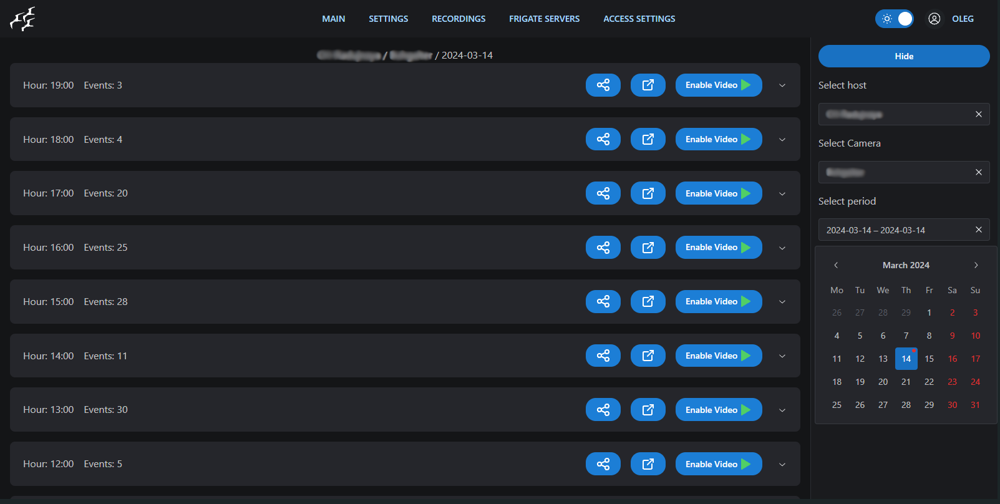

# Features
- Main page: Filter cameras using a search function.
- Main page: Filter cameras by host.
- Main page: Automatically update images.
- Main page: Optimized for mobile view.
- Live camera view page.
- Recordings page: Filter recordings by host, camera, and date.
- Recordings page: Options to play, download, and share videos.
- Recordings player page.
- Events page: Filter recordings by host, camera, and date and time.
- Access settings page: Configure which cameras are allowed and which are not.
- Frigate config editor page: Save and restart configuration using JSON schema from the host.
- Frigate system page: Display camera capture, ffmpeg, and decode stats. Show camera recordings storage stats.
- Frigate mask camera editor: Add, edit, delete camera masks.
- Admin pages access control: Restrict access to certain pages for administrators only.
- Keycloak OpenID provider authorization using JWT tokens.
# Instruction
Frontend for [Proxy Frigate](https://github.com/NlightN22/frigate-proxy)
 - create file: `docker-compose.yml`
```yml
version: '3.1'

services:
  front:
    image: oncharterliz/multi-frigate:latest
    environment:
      FRIGATE_PROXY: http://localhost:4000
      OPENID_SERVER: https://server:port
      CLIENT_ID: frontend-client
      REALM: frigate-realm
    ports:
      - 80:80 # set your port here
```
- run: 
```bash
docker compose up -d
```
For https connections you can use reverse proxy
# Example





